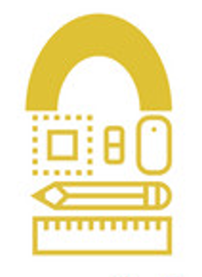

#  FINAL MODIFICATION PROPOSAL
- Currently, data such as account emails, passwords, usernames, goals, notes, tasks, and habits are modified in the memory, saved back to local storaged, and re-rendered. We implemented two key strategies when it came to removing data, a soft and hard delete. Soft delete is for tasks only, where tasks are mark completed or are kept in storage for statistics. The hard delete option permanently removes data from arrays using splice (is also removed from localStorage and statistics). This is client-side only storage with no backend database, and data persists only in that browser. 
## What we could add
- In the future, we could make it so that users can update their information. As of now, in terms of CRUD, we only have create and read for user accounts. Users cannot change their passwords, and they cannot delete account/personal data. Another thing we could implement is user settings, where users can manage preferences, account settings, and manage their profile overall. A bulk delete/edit/clear/reset fuction could also be of use. There are actually many more things we could do that implement CRUD, so here are some more of the main ones; note tags, project/note folders, achievements, workspaces (entirely new LockIn tabs for tracking of tabs related to Work/Personal/School), and tasks comments.

# 3rd Quarter Update
## Final Title
- LockIn
## 2-sentence description
- This website helps you build healthy habits through listing of tasks, knowing deadlines, seeing data about your performance, and so much more! Our goal is to not only provide the user an efficient experience, but also one that is satisying and easy to navigate.
## Features (Min. 3)
-  Our tabs provide features such as a planner and notes tab that saves your input. We also have a goals tab that offers an efficient way for you to remember goals that you set yourself. To ensure that each user has a way to access their personal tasks/data, we added a login system where a user can sign in and log out of their created account. The dashboard was also updated to show quick stats that can help the user identify what needs to be worked on. A statistics tab is also present to show your progress throughout the days, streaks, tasks completed, and overall data that is stored in our website. Finally, to support all devices, we added code to make our website mobile friendly.
## Definition of done
- Our group will consider our website finished once we complete all the neccersary features of each tab, and when we are satisfied with the overall design.

# Q2 Project Proposal 
1. Working title: Lockin
2. Second title: TaskTrack 
3. Logo: 
    - 
4. Description: 
This is a website that helps with tracking your task and to help you not procrastinate. We have multiple tools such as a planner where you can schedule due dates, a goal page where you can set goals to achieve, a statistics page which helpes you see your statistics when it comes to doing requirements or stats, and an about us page where you can see our backrounds and why we made this website.
5. Outline of the website:
    - Home page: this page contains the links to the other pages and the description.
    - Planner: This page helps you track your tasks and the due dates.
    - Goals: this is a page that helps you set goals long for long term for example you want to get 10 tasks done by the end of the week.
    - Statistics: Shows all you statistics on this app like amount of tasks done or productivity rate.
    - Notes: Notes to yourself about things to do. You can store ideas, thoughts, and other references here on this tab.
6. Description of JS
    * Statistics page: calculates the percentage of tasks status. It will also be used to clalculate for task rate, time where most tasks were completed and time spent on completing tasks.
7. Wireframe: [wireframe](https://www.canva.com/design/DAG3JACwuHE/J3tm5Fz0m0I3zM4_xQkbsw/edit?ui=e30)

